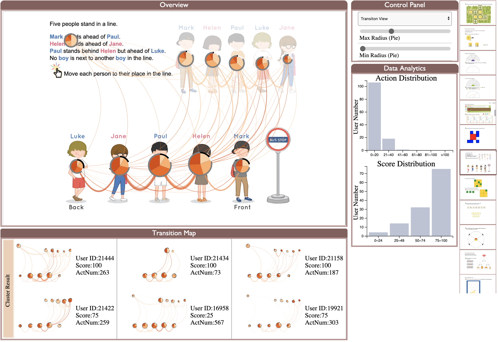
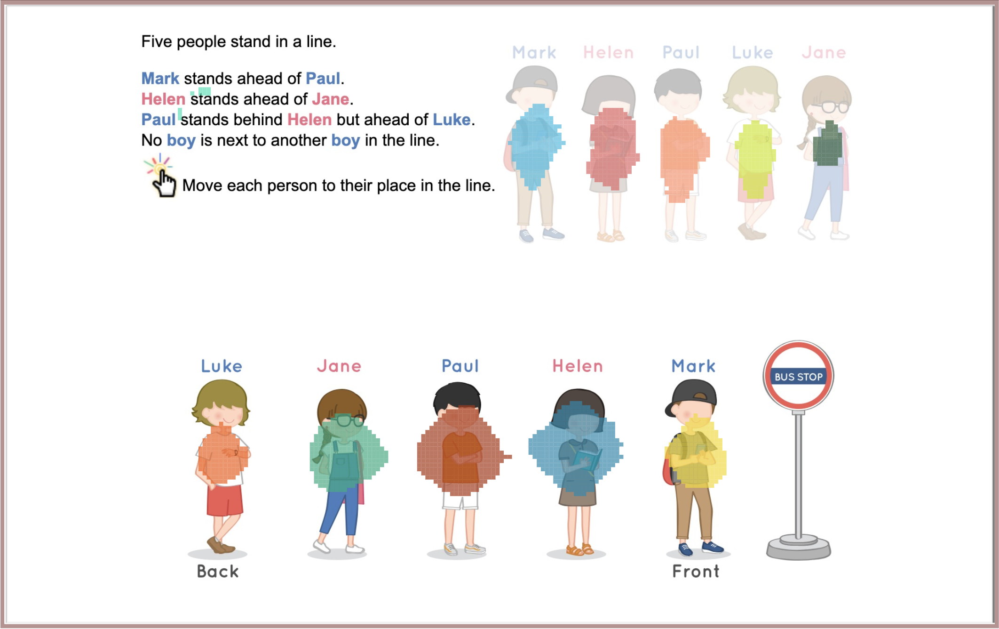
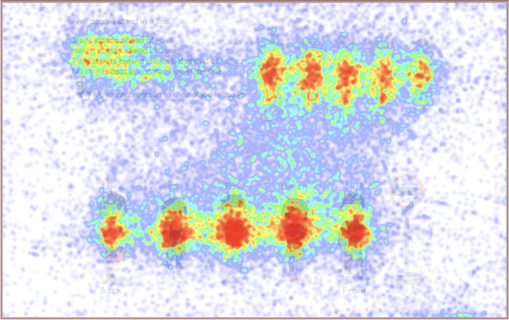
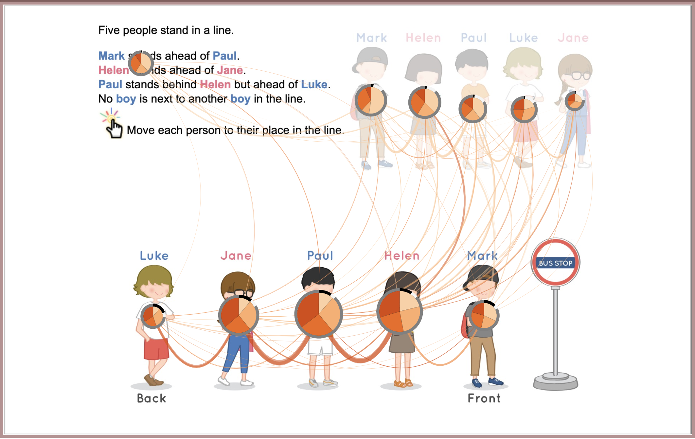

# Visual Analytics System
## How to run the code
- Prerequisites: Install npm and Node.js
- `cd vislab-elearning-p2/backend/` and then `python run.py`
- `cd vislab-elearning-p2/` and then `npm run dev`
- open the link: http://127.0.0.1:8080/

> We haven't uploaded the cache file which is necessary for runing the code. If you want to test the system by yourself, please contact us.
## System Overview

The system is designed for educators to observe students' behaviors and performances on different questions. The questions chosen as samples are from a math problem platform focusing on junor/middle students.
Users could choose different questions on the right bar of the system. *Overview* part of the system provides three views, which are *ROI view*, *Heatmap View* and *Transition View*. You can choose view in the *Control Panel*. And the *Control Panel* also let user to adjust parameters for each view. The *Data Analytics* part has two statistic bar charts, where one is the action distribution and another is the score distribution of the chosen question. The *Transition Map* part is still in process and our thought is to cluster students' behavior and then choose specify cluster to show every transition map from the cluster in this part.

### Three Views

